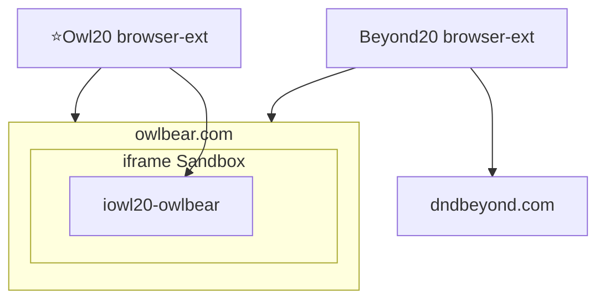
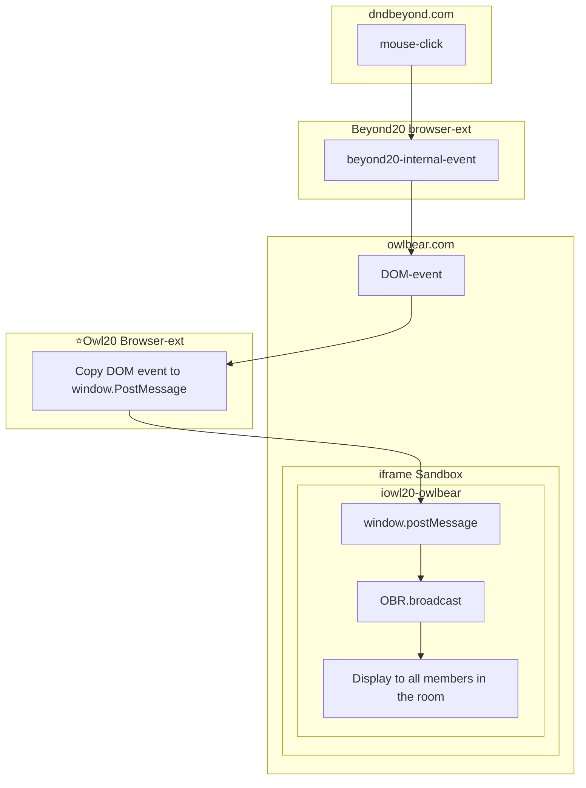

## DEV

Local development
* Install Beyond20 browser extension
* Whitelist https://www.owlbear.com/* in Beyond20 browser extension
* Install Owl20 browser extension
* `npm run dev`
* add http://localhost:5173/manifest.json as an owlbear extension.

### Control

### Data Flow

